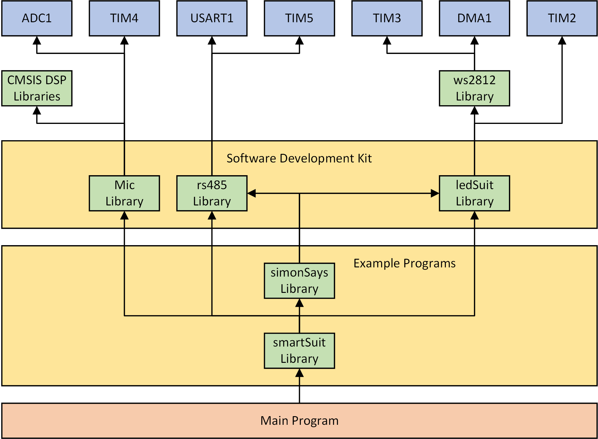

# Smart dancing suit

The smart dancing suit project was part of the [Wearable Computing Systems Lab Course](https://es.informatik.uni-freiburg.de/teaching/wearable-lab) during the summer semester of 2017. The idea is to develop an LED covered dancing suit which generates a light show according to the current music and movements of the wearer, instead of running a predefined choreography like it is done in other approaches. This is what makes the suit a “smart" dancing suit.

Therefore the suit is equipped with a couple of sensors, which enable sensing of motions and sound. For the sound measurement, a microphone module is used. The measurement samples are then used to calculate the sound level or to apply a Fourier transform. The music spectrum can be shown on the chest display.
The motion measurements are performed by inertial measurement units (IMUs) which are mounted on hands and feet. This allows movement detection of individual body parts.


## Contents

* [System architecture](https://github.com/benninge/wearable_suit/blob/master/README.md#hardware-architecture)
    * [Mainboard](https://github.com/benninge/wearable_suit/blob/master/README.md#mainboard)
    * [Sensor Board](https://github.com/benninge/wearable_suit/blob/master/README.md#sensor-board)
* [Software](https://github.com/benninge/wearable_suit/blob/master/README.md#software)
    * [Mainboard firmware](https://github.com/benninge/wearable_suit/blob/master/README.md#mainboard-firmware)
    * [Sensor board firmware](https://github.com/benninge/wearable_suit/blob/master/README.md#sensor-board-firmware)
    * [App](https://github.com/benninge/wearable_suit/blob/master/README.md#app)


## Hardware architecture

The system is built according to the hardware architecture given in figure 1. The centerpiece of the system is the mainboard. It contains an STM32 microcontroller, which controls all the other modules. It is connected to the IMU sensor modules over a bus systems and it directly controls all LEDs as well as the microphone module, which is used for music detection. A bluetooth connection to an Android app was also planned, but is currently not implemented.

<figure role="group">
<div align="center"></div> 
<div align="center"><figcaption> Figure 1: Schematic setup of the system </figcaption></div> 
</figure>


### Mainboard

The mainboard consists of an STM32F411E discovery board with a breadboard shield. The shield powers the discovery board and connects it to the sensor boards, the WS2812 RGB LED strips on arms and legs, the 10 x 10 LED display on the chest and the Adafruit MAX9814 microphone module. A wiring diagram of the mainboard shield is shown in figure 2.

<figure role="group">
<div align="center"></div> 
<div align="center"><figcaption> Figure 2: Wiring diagram of the mainboard shield </figcaption></div> 
</figure>

The sensor boards are connected over an RS-485 based bus system. The RS-485 transceiver should be a model with a 3.3V logic level. The chest display and the LED strips have to be connected according to the defines in the header files WS2812.h, ledSuit.h and the source file ledSuit.c of the mainboard firmware (which may be configured according to the used led-strip lengths). Since the LED strips are powered with 5V, each LED strip uses a switching regulator to generate its supply voltage out of the 3s LiPo power supply (which is called VCC here).


### Sensor board

The sensor module is an Arduino compatible custom circuit board. Figure 3 shows an assembled sensor board. The EAGLE files can be found in the "SensorBoard" folder in this repository. The sensor board hardware uses an ATmega328P microcontroller and a MPU-9250 IMU. It is directly powered by the 3s LiPo power supply and connected to the mainboard over the RS-485 bus.

<figure role="group">
<div align="center"></div> 
<div align="center"><figcaption> Figure 3: Sensor board </figcaption></div> 
</figure>


## Software

This project provides a software development kit for the mainboard containing examples. Additionally, a sensor board firmware is provided as well as an incomplete Android app to control the suit with a smartphone.


### Mainboard firmware

The mainboard firmware can be found in the "mainboard" folder. It contains all libraries for developing your own project as well as some example programs which show the capabilities of the provided libraries.


#### Libraries

The module structure of the mainboard firmware is shown in figure 4. The used hardware modules are colored in blue and the libraries are colored in green. The whole suit functionality can easily be accessed through high level functions, provided by the software development kit libraries. The example program libraries show how the software development kit can be used, to program specific applications.

<figure role="group">
<div align="center"></div> 
<div align="center"><figcaption> Figure 4: Module structure of the mainboard firmware </figcaption></div> 
</figure>


#### Examples

The smartSuit library offers some example programs which show the capabilities of the software development kit. The examples are directly called in the main function and can be chosen by passing a different demo number to the smartSuit_demo function :
```c
void smartSuit_demo(int demoNumber);
```
The following demos are available:

1. Music spectrum and color fade auto rotate demo: Shows the music spectrum on the chest display and an automatically rotating color fade on arms and legs.
2. Sound level and moving demo: Lights up moving body parts with an automatically rotating color fade. The suit brightness depends on the sound level.
3. Music spectrum and strobe moving demo: Shows the music spectrum on the chest display and lights up moving body parts with a strobe.
4. Moving and auto color fade demo: Fades the color of the whole Suit and lights up moving body parts.
5. Pulse and smiley demo: Shows moving pulses on arms and legs and a smiley on the chest display.
6. Play Simon says: An implementation of the game "Simon says". The suit displays body movements, which the wearer has to reproduce.


### Sensor board firmware

Before flashing the firmware to the sensor boards, the Arduino bootloader needs to be flashed to the sensor boards according to the [Arduino ISP instructions](https://www.arduino.cc/en/Tutorial/ArduinoISP). The sensor board firmware can be found in the "arduino/src/mpu9250_basicDMP" folder.

The Digital Motion Processor (DMP) on the IMU of each sensor board performs 6-axis sensor fusion (ignoring the integrated magnetometer and barometer) using the [motion driver library](http://www.digikey.de/en/pdf/i/invensense/motion-driver-6-1-user-guide) of Invensense. The resulting quaternions and acceleration values are transmitted over I^2C to the ATmega328P microcontroller 100 times per second. The microcontroller then converts the quaternions into the Euler coordinate system and normalizes the acceleration values into multiples of g = 9.81 m/s^2. 9-axis fusion is possible using the MPU9250, but would result in a slower update rate and additional need to calibrate the magnetometer each time the suit is powered up.

A master-slave communication over RS485 is used to communicate these values from each sensor board to the mainboard. The master (mainboard) requests new sensor values of one slave (sensor board) at a time. This avoids possible packet collisions on the bus. To differentiate the sensor boards from each other, the SLAVE_ID in mpu9250_basicDMP.ino has to be set to a value between 1 and 4 which represents the sensor boards specific ID. Once a sensor board receives a request for new values, it checks if the request was meant for its SLAVE_ID. If that is the case, it sends back a package with the current yaw, pitch, roll, the current rates at which these values change, and the 3-axis acceleration values.

The following values for SLAVE_ID are used:
* SLAVE_ID = 1: left arm
* SLAVE_ID = 2: right arm
* SLAVE_ID = 3: left leg
* SLAVE_ID = 4: right leg


### App

The "App" folder contains the app source code. The app is programmed with Android Studio and therefore available for Android devices. With the help of the "Dancing Suit" app the user can select features for the suit. The app run on a smartphone but cannot connect to the suit yet, because the Bluetooth communication to the mainboard is not fully implemented.

The app starts with a splash screen. From the main activity the user can connect the suit to the Bluetooth module and slide in a navigation drawer. It contains the navigation destinations: Right Arm, Left Arm, Right Leg, Left Leg, Suit, Demo, Info and Share and is shown in figure 5. The user can control each body part separately, can set settings for the hole suit, get information about the developer and find the share link for github.

In the activity COLOR (figure 6) the settings for colors can be set. The checkboxes allow the user to select the colors. Furthermore, there are activities for the COLORFADE and the AUTOCOLORFADE. To get a overview about the functions and what they do, check out the header file ledSuit.h.

For every of the three activities there is a spinner to choose the blinking-patter of the suit. Figure 7 show the contents in a pop-up dialog.

To implement the wireless data exchange the Android Bluetooth APIs are used. The scan for bluetooth devices and adapting to the module with the insert mac address works but there is no function for data transmission.
