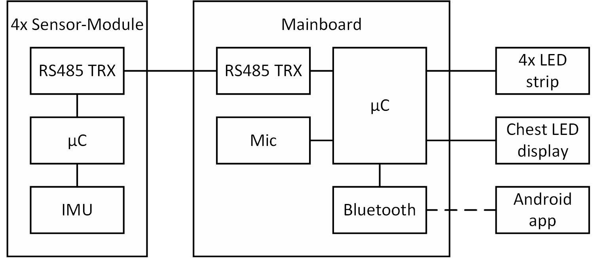

# Smart dancing suit

The smart dancing suit project is part of the [Wearable Computing Systems Lab Course](https://es.informatik.uni-freiburg.de/teaching/wearable-lab) in SS2017. The idea is to develop an LED covered dancing suit which generates a light show according to the current music and movements of the wearer, instead of running a predefined choreography like it is done in other approaches. This is what we call a “smart" dancing suit.

Therefore the suit is equipped with a couple of sensors which enable sensing of motions and sound.
For the sound measurement a microphone module is used. The measurement samples are then used to calculate the sound level or to apply a Fourier transform. The music spectrum can be shown on the chest display.
The motion measurement are performed by IMUs which are mounted on hands and feet. This allows a movement detection of individual body parts.

## Contents

* [System architecture](https://github.com/benninge/wearable_suit/blob/master/README.md#hardware-architecture)
    * [Mainboard](https://github.com/benninge/wearable_suit/blob/master/README.md#mainboard)
    * [Sensor Board](https://github.com/benninge/wearable_suit/blob/master/README.md#sensor-board)
* [Software](https://github.com/benninge/wearable_suit/blob/master/README.md#software)
    * [Mainboard firmware](https://github.com/benninge/wearable_suit/blob/master/README.md#mainboard-firmware)
    * [Sensor board firmware](https://github.com/benninge/wearable_suit/blob/master/README.md#sensor-board-firmware)
    * [App](https://github.com/benninge/wearable_suit/blob/master/README.md#app)

## Hardware architecture

The System is built according to the hardware architecture given in figure 1.

// TODO: Was zum bild schreiben

<figure role="group">

 

<figcaption> Figure 1: Schematic setup of the system </figcaption>
 
</figure>

### Mainboard

The mainboard consists of an STM32F411E discovery board with a breadboard shield. The shield powers the discovery board and connects it to the sensor boards, the WS2812 RGB LED strips on arms and legs, the 10 x 10 LED display on the chest and the Adafruit MAX9814 microphone module. A wiring diagram of the mainboard shield is shown in figure 2.

<figure role="group">

 

<figcaption> Figure 2: Wiring diagram of the mainboard shield </figcaption>
 
</figure>

The sensor boards are connected over an RS-485 based bus system. The RS-485 transceiver needs to be a model with 3.3V logic level. The chest display and the LED strips have to be connected according to the defines in WS2812.h ledSuit.h and ledSuit.c of the mainboard firmware (which may be configured according to the used led-strip lengths). Since the LED strips are powered with 5V, each LED strip uses a switching regulator to generate its supply voltage out of the 3s LiPo power supply.

### Sensor board

The sensor module is an Arduino compatible custom circuit board. Figure 3 shows an assembled sensor board. The EAGLE files can be found in the "SensorBoard" folder in this repository. The sensor board hardware uses an ATmega328P microcontroller and an MPU-9250 IMU. It is directly powered by the 3s LiPo power supply and connected to the mainboard over the RS-485 bus.

<figure role="group">

 

<figcaption> Figure 3: Sensor board </figcaption>
 
</figure>

## Software

This project provides a software development kit for the mainboard containing exaples. Additionally a sensor board firmware is provided as well as an incomplete android app to control the suit with a smartphone.

### Mainboard firmware

The mainboard firmware can be found in the "mainboard" folder. It contains all libraries for developing your own project as well as some example programs which show the capabilities of the provided libraries.

#### Libraries

// TODO: Was zur Modulstruktur schreiben

// TODO: Bild mit Modulstruktur einfügen

#### Examples

// TODO: Was zu den Beispielprogrammen schreiben

### Sensor board firmware

Before flashing the firmware to the sensor boards, the Arduino bootloader needs to be flashed to the sensor boards according to the [Arduino ISP instructions](https://www.arduino.cc/en/Tutorial/ArduinoISP). The sensor board firmware can be found in the "arduino/src/mpu9250_basicDMP" folder.

// TODO: Was zur sensor board firmware schreiben

### App

The "App" folder contains the app source code. the app cannot be used yet, because the bluetooth communication is not fully implemented.

// TODO: Was zur App schreiben