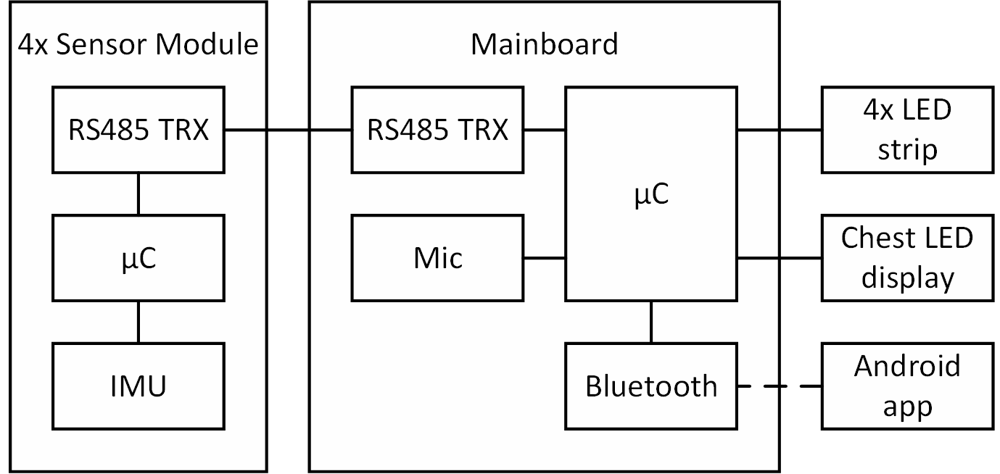

# Smart dancing suit

The smart dancing suit project is part of the [Wearable Computing Systems Lab Course](https://es.informatik.uni-freiburg.de/teaching/wearable-lab) in SS2017. The idea is to develop an LED covered dancing suit which generates a light show according to the current music and movements of the wearer, instead of running a predefined choreography like it is done in other approaches. This is what we call a “smart" dancing suit.

Therefore the suit is equipped with a couple of sensors which enable sensing of motions and sound.
For the sound measurement a microphone module is used. The measurement samples are then used to calculate the sound level or to apply a Fourier transform. The music spectrum can be shown on the chest display.
The motion measurement are performed by IMUs which are mounted on hands and feet. This allows a movement detection of individual body parts.

## Contents

* [System architecture](https://github.com/benninge/wearable_suit/blob/master/README.md#system-architecture)
* [Mainboard firmware](https://github.com/benninge/wearable_suit/blob/master/README.md#mainboard-firmware)

## System architecture

The System is built according to the hardware architecture given in the following image.

The sensor module is an Arduino compatible custom circuit board. The eagle files can be found in the "SensorBoard" folder in this repository. The sensor board hardware uses an ATmega328P microcontroller and an MPU-9250 IMU. It is directly powered by the 3s LiPo power supply and connected to the mainboard over an RS-485 based bus system.
Before flashing the firmware to the sensor boards, the Arduino bootloader needs to be flashed to the sensor boards according to the [Arduino ISP instructions](https://www.arduino.cc/en/Tutorial/ArduinoISP). The sensor board firmware can be found in the "arduino/src/mpu9250_basicDMP" folder.

The mainboard consists of an STM32F411E discovery board with a breadboard shield. The shield powers the discovery board and connects it to the sensor boards, the WS2812 RGB LED strips on arms and legs, the 10 x 10 LED display on the chest and the Adafruit MAX9814 microphone module. A schematic of the mainboard shield is shown in the image below. The mainboard firmware can be found in the "mainboard" folder.

// TODO: Bild mit shield Schaltplan einfügen

The "App" folder contains the app source code. the app cannot be used yet, because the bluetooth communication is not fully implemented.

## Mainboard firmware

// TODO: Was zur Modulstruktur schreiben

// TODO: Bild mit Modulstruktur einfügen

// TODO: Was zu den Beispielprogrammen schreiben